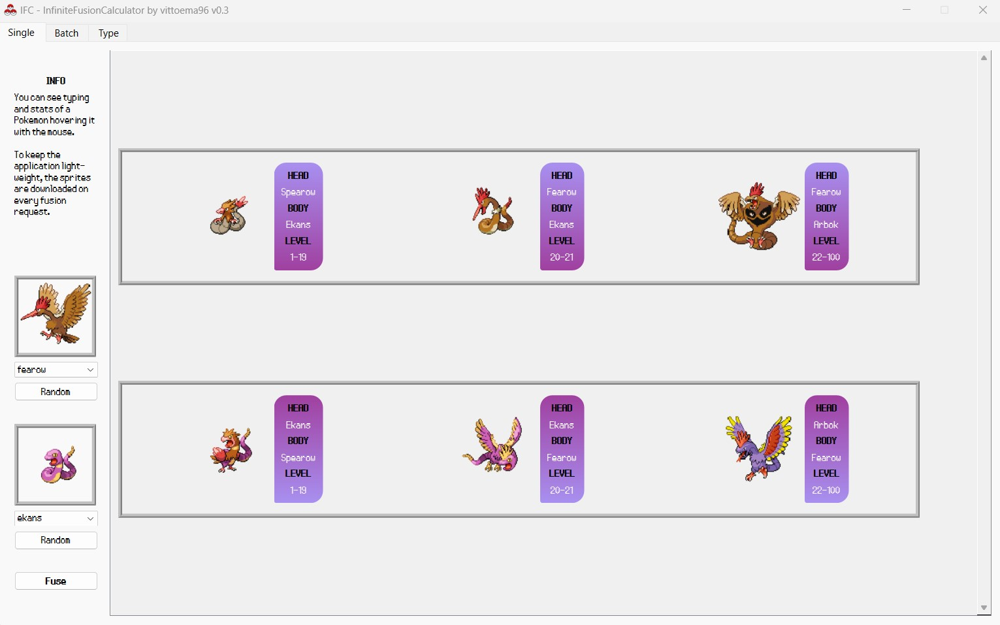
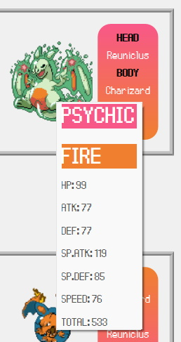
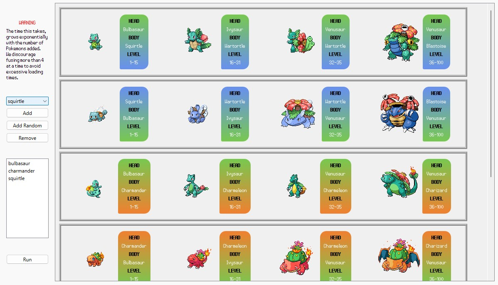

# InfiniteFusionCalculator by vittoema96

## Table of Contents
1. [Introduction](#introduction)
2. [What does it do](#explanation)
    - [Example](#example)
    - [Stats and types](#stats)
    - [Modes](#modes)
      - [Single](#single) 
      - [Batch](#batch)
3. [Installation](#install)
   - [App .exe](#exe)
     - [Rebuild .exe](#rebuild_exe)
   - [Python Project](#python)
4. [What was used](#info)

# 1. Introduction 
This project is intended as an improvement on the functionalities 
of [Pokemon Infinite Fusion Calculator](https://aegide.github.io/).

# 2. What does it do 

It shows full evolution lines of fusions between Pokemon.  

## Example 
### Fearow + Ekans
  
### Fearow evolution line   
- Spearow [1-19] 
- Fearow [20-100]  
### Ekans evolution line  
- Ekans [1-21] 
- Arbok [22-100] 
### Fusions:  
- Ekans + Spearow [1-19] 
- Ekans + Fearow [20-21] 
- Arbok + Fearow [22-100]

## Stats and types 
The typing of a Fusion is simply deductible from the colors of the box at the right of the Fusion Sprite.  

If that's not enough, hovering a fusion with the mouse allows a Tooltip to appear.  

This tooltip will display:
- The type (or types) of the Fusion
- The stats of the Fusion  

  

## Modes 

This application has 2 modes:
### Single 
Performs fusion between two Pokemon as described in the [Example](#example) .

### Batch 
Given a list ok pokemon, calculates all the possible pairs and performs fusion between them.   

<b>WARNING</b>  
This mode tends to download A LOT of sprites, the time it takes <b>grows exponentially</b>
with the number of Pokemon added to the list.  
Also, <b>adding Eevee</b> or any of the Eeveelutions will also <b>increment the computing time</b> dramatically, 
due to having 9 * <number of stages in the evolution tree of Fusion Pokemon #2> sprites to download for
every fusion evoline that includes Eevee (or the Eeveelution).

  

# 3. Installation 
If you just want to run the program read [App .exe](#exe).  

If you want to open the project in an IDE read [Python project](#python).   

If you edited the program and want to rebuild the .exe read  [Rebuild .exe](#rebuild_exe).  

## App .exe 
If your only goal is to run the app, what you really need is to download 
the [dist/IFC/](dist/IFC/) folder.  
You can also download a .zip from [here](https://mega.nz/file/VY8imSAK#h8pCk95VKGGIYRWXhQ3OmOPoFYlWjyoKarlRJJLkVCE).  

Once downloaded, run the `IFC.exe` file that you'll find inside.

### Rebuild .exe 
If you are editing the app and want to recompile the `IFC.exe`,
run  
`python build_exe.py`  
and the program will be recompiled to an exe inside the [dist/IFC/](dist/IFC/) folder using `auto-py-to-exe`.

## Python Project 

To run the python project, first create a `venv` with Python 3.8  
Activate it and run the command  
`pip install -r requirements.txt`.  
This will install the required libraries.  
Then run  
`python main.py`

# What was used 

### PokeAPI  
 
[PokeAPI](https://pokeapi.co/) was used to gather data about pokemon, such as 
minimum and maximum levels, typings, evolution lines and stats.  

#### Stats and Types

Stats are calculated as stated here:  https://infinitefusion.fandom.com/wiki/Pok%C3%A9mon_Fusion#Stats  
Typing takes into account this: https://infinitefusion.fandom.com/wiki/Pok%C3%A9mon_Fusion#Typing

## Vanilla sprites
Pokemon sprites are dynamically downloaded from here:   
`https://img.pokemondb.net/sprites/black-white/normal/<pokemon_name>.png`  
### Bulbasaur Example:  
https://img.pokemondb.net/sprites/black-white/normal/bulbasaur.png  
  

## Fusion sprites
Fusion sprites are dynamically downloaded from here:  
` https://raw.githubusercontent.com/Aegide/custom-fusion-sprites/main/CustomBattlers/<head_pokedex_id>.<body_pokedex_id>.png`   
### Charizard + Blastoise Example:  

https://raw.githubusercontent.com/Aegide/custom-fusion-sprites/main/CustomBattlers/9.6.png  

(If the app can't find the sprite, it will try look under `master/Battlers`, `master/Battlers/<head_dex_id>` and 
`autogen-fusion-sprites/master/Battlers/<head_dex_id>`)

### auto-py-to-exe
The application is compiled to an .exe using [auto-py-to-exe](https://pypi.org/project/auto-py-to-exe/)
